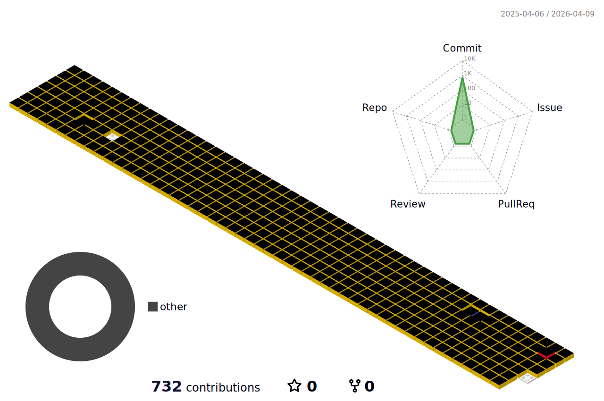

### <h1>Hi there 👋<h1>

 

<h1>HOW TO REACH ME?</h1>   

<h1>My Portfolio</h1>

<h2>1. 핫도리 프로젝트</h2>

<a href="https://github.com/jh981117/HotProject">🔗 프로젝트 바로가기</a>

<h2>2. Eatable 프로젝트</h2>

  <a href="https://github.com/jh981117/EatTable_Backend">🔗 프론트엔드 바로가기</a> |
  <a href="https://github.com/jh981117/Eatable_App_Frontend">🔗 백엔드 바로가기</a>

<h3>Outline</h3>

  

<h3>Use Stack</h3>
<ul>
  <li>프론트엔드: HTML, CSS, BootStrap, JavaScript</li>
  <li>백엔드: JAVA, Servlet, MyBatis, OAUTH2, Spring Boot</li>
  <li>DB액션 처리: JDBC, MySQL, POSTMAN</li>
  <li>개발 Tool: Intellij, Git, GitHub, Google Drive</li>
</ul>

                  

<h1>GitHub Stats</h1>

