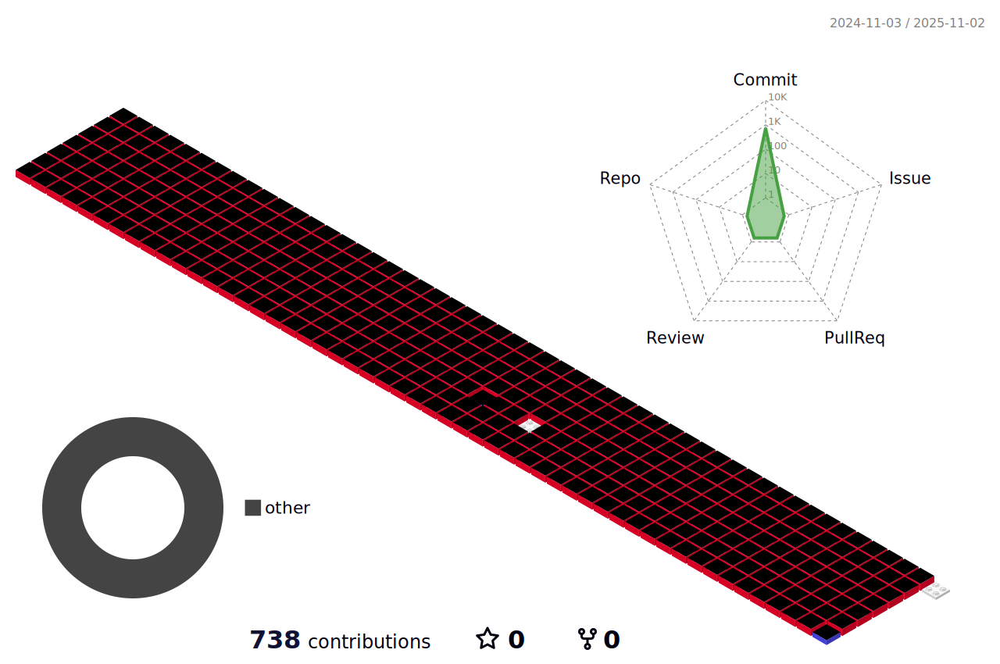

### <h1>Hi there 👋<h1>

 

<h1>HOW TO REACH ME?</h1>   

<h1>My Portfolio</h1>

<h2>1. 핫도리 프로젝트</h2>
<a href="https://github.com/jh981117/HotProject">프로젝트 바로가기</a>
<h2>2. Eatable 프로젝트</h2>
<a href="https://github.com/jh981117/EatTable_Backend">프론트 바로가기</a>  
<a href="https://github.com/jh981117/Eatable_App_Frontend">백엔드 바로가기</a>

<h3>
Outline
해외 공연/관광지 일정 사전 검색 및 항공편을 동일 사이트에서 확인 가능하여 일정 관리를 수월하게 할 수 있게 하기 위함.
Use Stack
프론트엔드: HTML, CSS, BootStrap, JavaScript
백엔드: JAVA, Servlet, MyBatis, OAUTH2, Spring Boot
DB액션 처리: JDBC, MySQL, POSTMAN
개발 Tool : Intellij, Git, GitHub, Google Drive
</h3>
                  

<h1>GitHub Stats</h1>

